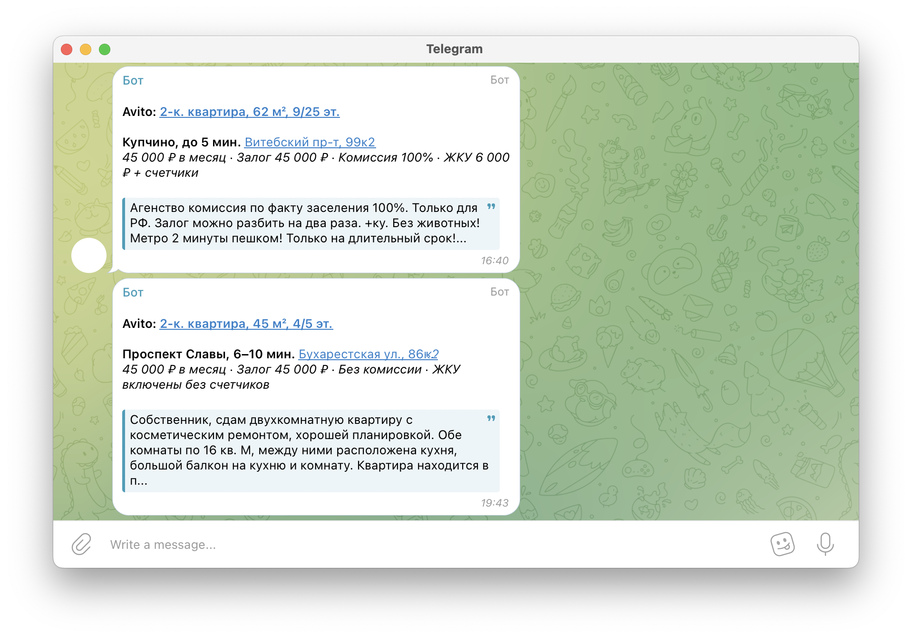

# **advertrappr**



Python приложение для оперативного уведомления о публикации объявлений на площадках популярных интернет-сервисов. 
> ВАЖНО: Текущая реализация предполагает обработку объявлений исключительно из сегмента съема недвижимости и не протестирован на остальных категориях.

### **Установка и запуск**
Локально, через CLI:
```bash
pip install git+https://github.com/dsp-shp/advertrappr.git

### Конфигурация отправки, необходимо указать токен бота и id чата
advertrappr config -m '{"token": "...", "chat_id": "..."}'

### Проверка отправки сообщения в чат
advertrappr send 'Hello, world!'

### Пример запуска приложения с отслеживанием объявлений Авито по поиску "..." и единоразовым обновлением
advertrappr run \
    --avito-url 'https://www.avito.ru/...' \
    --repeat 'None' \
    --dispose 'None' &

### Просмотр объявлений в табличной форме
advertrappr fetch 'advs' --table
```

В docker контейнере:
```bash
docker build https://github.com/dsp-shp/advertrappr.git \
    -t advertrappr \
    --build-arg MESSENGER='{"token": "...", "chat_id": "..."}'

### Пример запуска контейнера с отслеживанием объявлений Авито по поиску "...", обновлением каждые 90 секунд и очисткой данных старше 7 дней
docker run -d \
    -e AVITO_URL='https://www.avito.ru/...' \
    -e REPEAT='90' \
    -e DISPOSE='7' \
    advertrappr

### Просмотр последних 10 объявлений в JSON формате
docker exec -it CONTAINER_ID advertrappr fetch 'select * from advs order by __processed desc limit 10'
```

### **Конфигурация**
Конфигурационный файл располагается в пользовательской ```~/.advertrappr``` директории и представляет из себя YAML файл, по умолчанию содержащий:
```yaml
connector:
    ### Параметры инициализации/взаимодействия с DuckDB базой данных
    ### ВАЖНО: read_only параметр не учитывается
    database: /home/.../.advertrappr/duck.db

messenger:
    ### Параметры отправки сообщения
    cooldown: 5
    disable_web_page_preview: true
    parse_mode: HTML
    ### chat_id: '-1111111111111'
    ### token: 0123456789:AAAa00aaAAa0Aaa0aAAAAaAAa0AaAAAaAaA

parsers: {}
    ### Параметры парсинга исходного кода страницы
    ### handle_captcha: true

scrapper:
    ### Параметры скраппинга страницы Selenium фреймворком
    options:
    - --disable-gpu
    - --no-sandbox
    - --headless
```

Также возможна конфигурация шаблонов сообщений для отправки. HTML/Markdown шаблоны сообщений найти в ```~/.advertrappr/templates``` директории:
```html
⠀<br>
<b>{{service}}: <a href="{{link}}">{{title}}</a></b>

<b>{{station}}</b> <a href="{{map}}{{location_repl}}">{{location}}</a><br>
<i>{{price}}</i>

<blockquote>{{description_repl}}...</blockquote>
⠀
```
